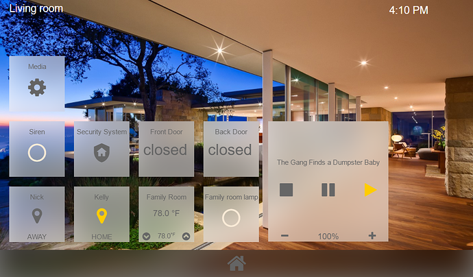

# Community Hass.io Add-ons: AppDaemon 4

[![GitHub Release][releases-shield]][releases]
![Project Stage][project-stage-shield]
[![License][license-shield]](LICENSE.md)

![Supports aarch64 Architecture][aarch64-shield]
![Supports amd64 Architecture][amd64-shield]
![Supports armhf Architecture][armhf-shield]
![Supports armv7 Architecture][armv7-shield]
![Supports i386 Architecture][i386-shield]

[![GitLab CI][gitlabci-shield]][gitlabci]
![Project Maintenance][maintenance-shield]
[![GitHub Activity][commits-shield]][commits]

[![Discord][discord-shield]][discord]
[![Community Forum][forum-shield]][forum]

[![Sponsor Frenck via GitHub Sponsors][github-sponsors-shield]][github-sponsors]

[![Support Frenck on Patreon][patreon-shield]][patreon]



Python Apps and HADashboard for Home Assistant

## About

AppDaemon is a loosely coupled, multithreaded, sandboxed python execution
environment for writing automation apps for Home Assistant home automation
software. It also provides a configurable dashboard (HADashboard) suitable
for wall mounted tablets.

## Installation

The installation of this add-on is pretty straightforward and not different in
comparison to installing any other Hass.io add-on.

1. Search for the "AppDaemon 4" add-on in the Hass.io add-on store and install
   it.
1. Start the "AppDaemon 4" add-on
1. Check the logs of the "AppDaemon3" add-on to see if everything went well.

:information_source: Please note, the add-on is pre-configured to connect with
Home Assistant. There is no need to create access tokens or to set your
Home Assistant URL in the AppDaemon configuration.

## Configuration

**Note**: _Remember to restart the add-on when the configuration is changed._

Example add-on configuration:

```json
{
  "log_level": "info",
  "system_packages": [
    "ffmpeg"
  ],
  "python_packages": [
    "PyMySQL",
    "Pillow"
  ]
}
```

**Note**: _This is just an example, don't copy and past it! Create your own!_

### Option: `log_level`

The `log_level` option controls the level of log output by the addon and can
be changed to be more or less verbose, which might be useful when you are
dealing with an unknown issue. Possible values are:

- `trace`: Show every detail, like all called internal functions.
- `debug`: Shows detailed debug information.
- `info`: Normal (usually) interesting events.
- `warning`: Exceptional occurrences that are not errors.
- `error`:  Runtime errors that do not require immediate action.
- `fatal`: Something went terribly wrong. Add-on becomes unusable.

Please note that each level automatically includes log messages from a
more severe level, e.g., `debug` also shows `info` messages. By default,
the `log_level` is set to `info`, which is the recommended setting unless
you are troubleshooting.

These log level also affects the log levels of the AppDaemon.

### Option: `system_packages`

Allows you to specify additional [Alpine packages][alpine-packages] to be
installed to your AppDaemon setup (e.g., `g++`. `make`, `ffmpeg`).

**Note**: _Adding many packages will result in a longer start-up time
for the add-on._

### Option: `python_packages`

Allows you to specify additional [Python packages][python-packages] to be
installed to your AppDaemon setup (e.g., `PyMySQL`. `Requests`, `Pillow`).

**Note**: _Adding many packages will result in a longer start-up time
for the add-on._

#### Option: `init_commands`

Customize your environment even more with the `init_commands` option.
Add one or more shell commands to the list, and they will be executed every
single time this add-on starts.

## AppDaemon and HADashboard configuration

This add-on does not configure the AppDaemon or HADashboard for you.
It does, however, create some sample files to get you started on the first run.

The configuration of the AppDaemon can be found in the `/config/appdaemon`
directory.

For more information about configuring AppDaemon, please refer to the
extensive documentation they offer:

<http://appdaemon.readthedocs.io/en/latest/>

## Home Assistant access tokens and ha_url settings

By default, this add-on ships without a `token` and without the `ha_url`
in the `appdaemon.yaml` config file. **This is not an error!**

The add-on takes care of these settings for you and you do not need to provide
or set these in the AppDaemon configuration.

However, you are free to set them if you want to override, however, in
general usage, that should not be needed and is not recommended for this add-on.

## Upgrading from AppDaemon 3.x

If you have previously ran AppDaemon 3.x (e.g., via an add-on), these steps
will help you getting upgraded to AppDaemon 4.x.

- After installing this add-on, stop the current running AppDaemon 3.x add-on.
- Open your `/config/appdaemon/appdaemon.yaml` file in an editor.
  - Remove the `log`.
  - Remove`threads`, `api_port`, `app_dir`, `ha_url` and `token`.
  - Add the following to the `appdaemon` section: `latitude`, `longitude`,
    `elevation` and `time_zone`.
  - Add a `http` section with `url: http://127.0.0.1:5050` in it.
  - At the end of the file add `admin:` and `api:`.
  - Remove everthing under `hadashboard:`, leaving just that.

The result should look something like this:

```yaml
---
secrets: /config/secrets.yaml
appdaemon:
  latitude: 52.379189
  longitude: 4.899431
  elevation: 2
  time_zone: Europe/Amsterdam
  plugins:
    HASS:
      type: hass
http:
  url: http://127.0.0.1:5050
hadashboard:
admin:
api:
```

Be sure to check the "Upgrading from 3.x" on the AppDaemon website:

<https://appdaemon.readthedocs.io/en/latest/UPGRADE_FROM_3.x.html>

## Changelog & Releases

This repository keeps a change log using [GitHub's releases][releases]
functionality. The format of the log is based on
[Keep a Changelog][keepchangelog].

Releases are based on [Semantic Versioning][semver], and use the format
of ``MAJOR.MINOR.PATCH``. In a nutshell, the version will be incremented
based on the following:

- ``MAJOR``: Incompatible or major changes.
- ``MINOR``: Backwards-compatible new features and enhancements.
- ``PATCH``: Backwards-compatible bugfixes and package updates.

## Support

Got questions?

You have several options to get them answered:

- The [Community Hass.io Add-ons Discord chat server][discord] for add-on
  support and feature requests.
- The [Home Assistant Discord chat server][discord-ha] for general Home
  Assistant discussions and questions.
- The Home Assistant [Community Forum][forum].
- Join the [Reddit subreddit][reddit] in [/r/homeassistant][reddit]

You could also [open an issue here][issue] GitHub.

## Contributing

This is an active open-source project. We are always open to people who want to
use the code or contribute to it.

We have set up a separate document containing our
[contribution guidelines](CONTRIBUTING.md).

Thank you for being involved! :heart_eyes:

## Authors & contributors

The original setup of this repository is by [Franck Nijhof][frenck].

For a full list of all authors and contributors,
check [the contributor's page][contributors].

## We have got some Hass.io add-ons for you

Want some more functionality to your Hass.io Home Assistant instance?

We have created multiple add-ons for Hass.io. For a full list, check out
our [GitHub Repository][repository].

## License

MIT License

Copyright (c) 2020 Franck Nijhof

Permission is hereby granted, free of charge, to any person obtaining a copy
of this software and associated documentation files (the "Software"), to deal
in the Software without restriction, including without limitation the rights
to use, copy, modify, merge, publish, distribute, sublicense, and/or sell
copies of the Software, and to permit persons to whom the Software is
furnished to do so, subject to the following conditions:

The above copyright notice and this permission notice shall be included in all
copies or substantial portions of the Software.

THE SOFTWARE IS PROVIDED "AS IS", WITHOUT WARRANTY OF ANY KIND, EXPRESS OR
IMPLIED, INCLUDING BUT NOT LIMITED TO THE WARRANTIES OF MERCHANTABILITY,
FITNESS FOR A PARTICULAR PURPOSE AND NONINFRINGEMENT. IN NO EVENT SHALL THE
AUTHORS OR COPYRIGHT HOLDERS BE LIABLE FOR ANY CLAIM, DAMAGES OR OTHER
LIABILITY, WHETHER IN AN ACTION OF CONTRACT, TORT OR OTHERWISE, ARISING FROM,
OUT OF OR IN CONNECTION WITH THE SOFTWARE OR THE USE OR OTHER DEALINGS IN THE
SOFTWARE.

[aarch64-shield]: https://img.shields.io/badge/aarch64-yes-green.svg
[alpine-packages]: https://pkgs.alpinelinux.org/packages
[amd64-shield]: https://img.shields.io/badge/amd64-yes-green.svg
[armhf-shield]: https://img.shields.io/badge/armhf-yes-green.svg
[armv7-shield]: https://img.shields.io/badge/armv7-yes-green.svg
[commits-shield]: https://img.shields.io/github/commit-activity/y/hassio-addons/addon-appdaemon.svg
[commits]: https://github.com/hassio-addons/addon-appdaemon/commits/master
[contributors]: https://github.com/hassio-addons/addon-appdaemon/graphs/contributors
[discord-ha]: https://discord.gg/c5DvZ4e
[discord-shield]: https://img.shields.io/discord/478094546522079232.svg
[discord]: https://discord.me/hassioaddons
[forum-shield]: https://img.shields.io/badge/community-forum-brightgreen.svg
[forum]: https://community.home-assistant.io/t/community-hass-io-add-on-appdaemon3/41261?u=frenck
[frenck]: https://github.com/frenck
[github-sponsors-shield]: https://frenck.dev/wp-content/uploads/2019/12/github_sponsor.png
[github-sponsors]: https://github.com/sponsors/frenck
[gitlabci-shield]: https://gitlab.com/hassio-addons/addon-appdaemon/badges/master/pipeline.svg
[gitlabci]: https://gitlab.com/hassio-addons/addon-appdaemon/pipelines
[home-assistant]: https://home-assistant.io
[i386-shield]: https://img.shields.io/badge/i386-yes-green.svg
[issue]: https://github.com/hassio-addons/addon-appdaemon/issues
[keepchangelog]: http://keepachangelog.com/en/1.0.0/
[license-shield]: https://img.shields.io/github/license/hassio-addons/addon-appdaemon.svg
[maintenance-shield]: https://img.shields.io/maintenance/yes/2020.svg
[patreon-shield]: https://frenck.dev/wp-content/uploads/2019/12/patreon.png
[patreon]: https://www.patreon.com/
[project-stage-shield]: https://img.shields.io/badge/project%20stage-experimental-yellow.svg
[python-packages]: https://pypi.org/
[reddit]: https://reddit.com/r/homeassistant
[releases-shield]: https://img.shields.io/github/release/hassio-addons/addon-appdaemon.svg
[releases]: https://github.com/hassio-addons/addon-appdaemon/releases
[repository]: https://github.com/hassio-addons/repository
[semver]: http://semver.org/spec/v2.0.0.htm
